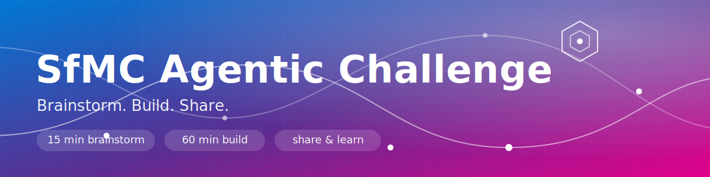
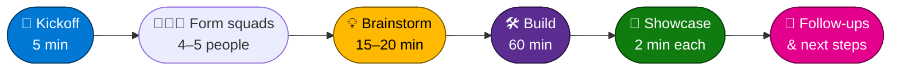
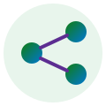

<p align="center">
  
</p>

<p align="center">
  
  
  
  
  
</p>

# SfMC Agentic Challenge

> **Brainstorm. Build. Share.**
> Three teams. Small squads. One afternoon to turn a daily annoyance into an AI workflow.

---

## ⚡ TL;DR

We split into **squads of 4–5 people**, spend **15–20 minutes** picking a real problem we hate doing manually, then **build for 60 minutes** using Microsoft AI tooling — Copilot, Copilot Studio, Power Automate, Azure AI Foundry, Frontier functions, Clawpilot / GitHub Copilot, anything goes. At the end every squad shares a **2-minute story**: what we tried, what worked, where we got stuck. Working code is *not* required. Honest stories are.

---

## 🎯 Why we're doing this

- Get hands-on with the **agentic tools** our colleagues are already using.
- Discover **what others have built** so we stop solving the same problem five times.
- Find **small wins** in our own day — inbox, calendar, meetings, status updates — that we can actually ship next week.
- Have fun. Build weird things. Share fail stories.

---

## 🗓️ Agenda

| # | Phase | Time | What happens |
|---|-------|------|--------------|
| 1 | 👋 **Kickoff** | 5 min | Welcome, rules, form squads |
| 2 | 💡 **Brainstorm** | 15–20 min | Pick a problem · scout tools · sketch the workflow |
| 3 | 🛠️ **Build** | 60 min | Build the thing. Anything goes. |
| 4 | 🎤 **Showcase** | ~2 min / squad | Share the story (worked, didn't work, what's next) |



---

## 🧑‍🤝‍🧑 Squad formation & roles


Squads of **4–5 people** — mix teams on purpose. Don't sit with the people you already chat with every day.

Pick these roles in the first 60 seconds (they're loose — swap any time):

| Role | What they do |
|------|--------------|
| 🚗 **Driver** | Has hands on the keyboard / clicks through the tool |
| 💭 **Idea-keeper** | Captures the problem statement + decisions in one short doc |
| 🔭 **Tool-scout** | Knows (or googles) which Microsoft tool fits — pulls in colleagues if needed |
| 🎙️ **Storyteller** | Owns the 2-minute showcase at the end |

> 💡 No PMs, no engineers, no architects today — only squads.

---

## 💡 Brainstorm guide (15–20 min)


Use these sparking questions. Don't try to answer all of them — pick what gets the squad talking.

1. **What did I do today that a robot should have done?**
2. **What part of my week makes me sigh?** (inbox? status updates? meeting prep?)
3. **Which colleague already built something cool?** — call them, steal the idea.
4. **What would a "first-week-on-the-job" me really want?**
5. **If we had an agent that just *did* one thing for us by Friday, what would it be?**

**Output of this phase:**

- ✅ One sentence: *"Our agent helps **<who>** to **<do what>** so they can **<benefit>**."*
- ✅ A rough list of tools you'll try
- ✅ A sketch / whiteboard photo of the flow

---

## 🧰 Problem idea catalog

Stuck on what to build? Steal one of these. Combine them. Make them weirder.

<details open>
<summary><b>📬 Inbox & communication</b></summary>

- **Inbox triage agent** — categorize, summarize, draft replies, surface "must answer today"
- **Newsletter digester** — pull insights out of the 12 newsletters you never open
- **"Reply for me" assistant** — drafts a reply in your tone of voice with the right context attached

</details>

<details open>
<summary><b>📅 Calendar & day planning</b></summary>

- **Calendar triage** — flag conflicts, suggest declines, auto-prep agendas
- **"Prep my day" agent** — every morning: today's meetings, who's attending, last interactions, open actions
- **Focus-time defender** — books focus blocks based on actual workload

</details>

<details open>
<summary><b>🎙️ Meetings & knowledge</b></summary>

- **Meeting-recording knowledge base** — index Teams recordings, ask questions across them
- **"What did we decide?" bot** — searches past meeting notes & chats for decisions
- **Onboarding buddy** — answers new joiners' questions from internal docs

</details>

<details open>
<summary><b>📊 Status, reporting, admin</b></summary>

- **Auto-status report** — pull from commits, PRs, ADO, calendar into a weekly update
- **Expense pre-filler** — read receipts → draft expense lines
- **Customer-case summarizer** — turn a long case history into a 5-bullet brief before the call

</details>

<details>
<summary><b>🌶️ Spicier / experimental</b></summary>

- Multi-agent "morning standup" that talks to itself before you arrive
- Voice-driven workflow trigger ("Hey agent, prep my 10am")
- Agent that watches a shared mailbox and opens an ADO work item

</details>

---

## 🧪 Toolbox


You don't need to know all of these. Pick **one or two** and go deep. Pull in a colleague who knows the others.

| | Tool | Good for |
|---|------|----------|
|  | **Microsoft 365 Copilot** | Inbox, Word, Excel, Teams — zero-code starting point |
|  | **Copilot Studio** | Build your own copilot/agent with topics, actions, knowledge |
|  | **Azure AI Foundry** | Models, prompt flows, evaluations, deploy as endpoint |
| ⚡ | **Frontier functions** | Custom AI-callable functions — wire models to real systems |
|  | **Power Automate** | Triggers + connectors (Outlook, Teams, SharePoint, Graph) |
|  | **Azure Logic Apps** | Power Automate's bigger sibling for production-ish flows |
| 🦾 | **Clawpilot** | Internal agent platform — ask in #clawpilot for tips |
|  | **GitHub Copilot / Agent mode** | Build code, glue, scripts — let it drive |
|  | **Microsoft Graph API** | The pipe to mail, calendar, files, Teams, people |

> 🔎 **Don't know the right tool?** Send the Tool-scout to another squad. Cross-pollination is encouraged.

---

## 🛠️ Build phase rules (60 min)


1. **Working code is optional.** A clickable mockup or a half-broken Power Automate flow counts.
2. **Document as you go.** One paragraph + screenshots beats a perfect demo that no one remembers.
3. **Steal shamelessly.** Walk to other squads. Ask. Share keys, prompts, links.
4. **Stuck > 10 min on the same wall?** Switch tools or shrink the problem.
5. **No production data.** Use samples, dummy mailboxes, or your own stuff.
6. **Time-box hard.** When the bell rings, hands off keyboards.

---

## 🎤 Showcase template (~2 min per squad)



Fill this in while you build. Storyteller presents it.

```markdown
### Squad name: ____________________

**1. Problem**     – What annoyance did we attack?
**2. Approach**    – How did we plan to solve it?
**3. Tools used**  – Copilot Studio? Power Automate? Foundry? Glue?
**4. Demo / Mock** – Screenshot, gif, or 30-second walk-through.
**5. Where we got stuck** – Be honest. This is the most useful slide.
**6. If we had one more day…** – What would we try next?
```

> 💬 **Why "where stuck" matters:** that's the bit a colleague in another squad probably already solved. Make it loud.

---

## 🏆 Judging & prizes

Fully unserious. Multiple winners. Everyone claps.

| Category | What we're looking for |
|----------|------------------------|
| 🧠 **Most useful** | "I want this on Monday morning" |
| 🎨 **Most creative** | Made us go *"wait, you can do that?"* |
| 💥 **Best fail story** | Honest, funny, and the rest of us learn from it |
| 🤝 **Best teamwork** | Pulled in other squads, shared, cross-pollinated |
| 🚀 **Ship-it candidate** | Most likely to become a real thing next sprint |

---

## ✅ Facilitator pre-event checklist

<details>
<summary>Open the checklist (for the organizer — that's me 👋)</summary>

**Before the day**
- [ ] Room booked with enough table clusters for ~10 squads
- [ ] Power, Wi-Fi, Teams room tested
- [ ] Whiteboards / flipcharts / sticky notes per table
- [ ] Shared OneNote or Loop page for squads to drop their notes + links
- [ ] Sample data / dummy mailbox available (no production data!)
- [ ] Snacks & caffeine ☕🍫
- [ ] Showcase order randomized
- [ ] Prizes / silly trophies

**On the day**
- [ ] 5-min kickoff slide ready (agenda + rules)
- [ ] Visible countdown timer
- [ ] Walk between squads during build phase — unblock, connect, encourage tool-scouting
- [ ] Capture photos for the recap
- [ ] Collect every squad's showcase template into one Loop / OneNote page

**After**
- [ ] Share the recap (photos + squad summaries + "where stuck" list)
- [ ] Open a follow-up channel for the ideas that sparked
- [ ] Ping owners of "ship-it candidate" ideas with next steps

</details>

---

## 🔗 Resources & links

- [Microsoft 365 Copilot](https://www.microsoft.com/microsoft-365/copilot)
- [Copilot Studio](https://learn.microsoft.com/microsoft-copilot-studio/)
- [Azure AI Foundry](https://learn.microsoft.com/azure/ai-foundry/)
- [Power Automate](https://learn.microsoft.com/power-automate/)
- [Azure Logic Apps](https://learn.microsoft.com/azure/logic-apps/)
- [GitHub Copilot](https://docs.github.com/copilot)
- [Microsoft Graph API](https://learn.microsoft.com/graph/)

---

<p align="center">
  <i>Built fast. Shared faster. — see you at the showcase. 🎤</i>
</p>

